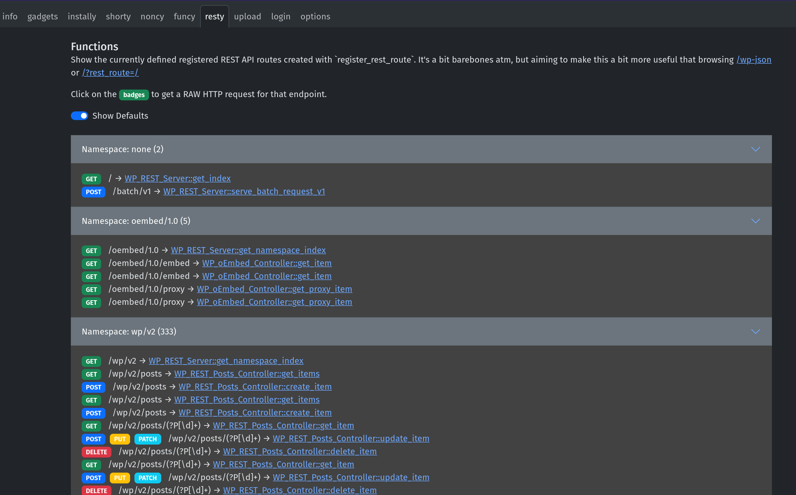
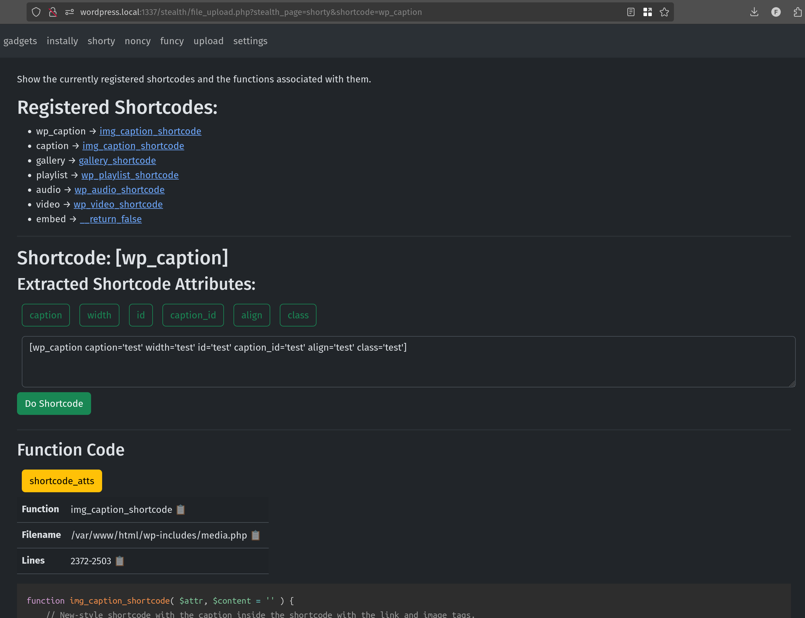
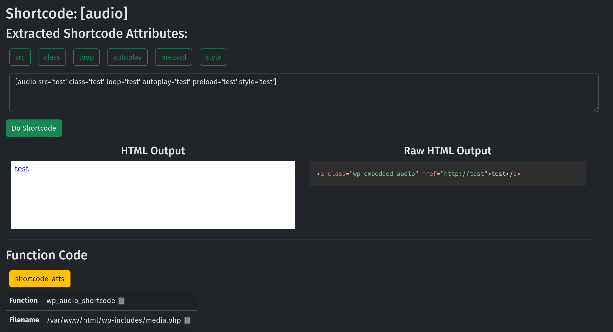
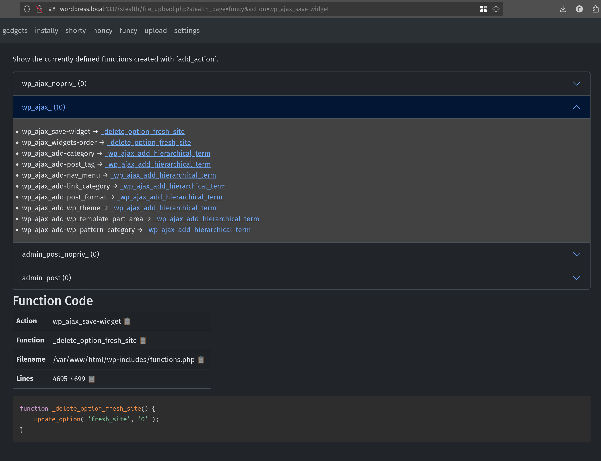
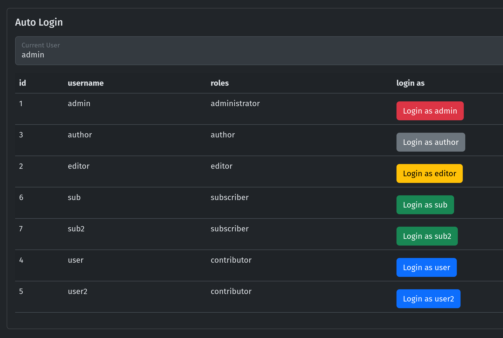
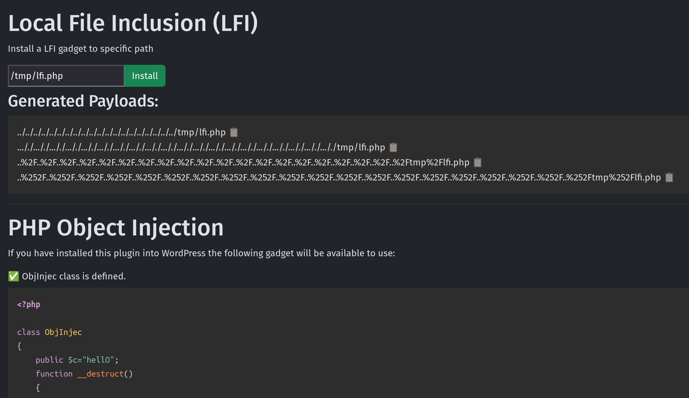

This set of little helpers for WordPress hacking can either be installed as a plugin or just dumped into the webroot.

⚠️ Warning: You probably shouldn't install this on a production environment as it could easily be abused by an attacker.

## Installation Methods

### Manually

- Download the [stealth.zip](https://github.com/stealthcopter/wordpress-hacking/releases/latest/download/stealth.zip)
- Install the plugin from the `/wp-admin/plugin-install.php` page

### WordPress CLI

If you have the WordPress CLI installed you can get it running with this one-liner:

```
wp plugin install --activate https://github.com/stealthcopter/wordpress-hacking/releases/latest/download/stealth.zip
```

### Web Installation Methods

If you don't want to install it as a plugin you can just dump this zip into the webroot and it will try and find `wp-load.php` automatically so it can hook in.

```
cd /var/www/html
wget https://github.com/stealthcopter/wordpress-hacking/releases/latest/download/stealth.zip
unzip stealth.zip
```

# Support
If you love what I'm doing with wordpress-hacking or my other projects, please feel free to contribute without spending money by creating issues, PRs, or just messaging me to let you know you use it. And of course, you can directly sponsor this project on GitHub or buy me a coffee ☕! Thank you for your support – it means the world to me and the open source community!

<a href="https://www.buymeacoffee.com/stealthcopter"></a>

# Usage

Either:

- Navigate to `/stealth` - this only works if permalink structure is set to `posts`
- Otherwise, navigate to `/wp-content/plugins/stealth` or wherever the code is, to use the tools

## Tools

- **Resty** - find all registered REST routes and display their functions and information.



- **Shorty** - find and analyse declared shortcodes





- **Funcy** - find and analyse declared actions



- **Login** - automatically login as other users



- **Gadgets** - LFI and PHPObject injection gadgets



- **Noncy** - Generate nonces

- **Options** - List and filter all options
- **Upload** - An upload widget to save time creating payloads

# Contributing

If you have an idea for a new feature please create a new issue on GitHub. If you would like to contribute a bug fix, or feature please feel free to fork the repo and submit a PR against this one.

# TODO
See the [todo.md](todo.md) file for a brain dump of things that are planned.
