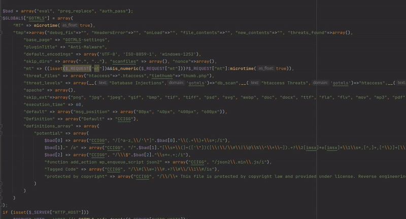

# Post Report Info

- Link: https://patchstack.com/database/vulnerability/gotmls/wordpress-anti-malware-security-and-brute-force-firewall-plugin-4-21-96-unauthenticated-predictable-nonce-brute-force-leading-to-rce-vulnerability
- CVE: 2024-22144
- Bounty: 270 AXP

# gotmls-rce

Unauthenticated Remote Code Execution (RCE) in the [Anti-Malware Security and Brute-Force Firewall](https://en-gb.wordpress.org/plugins/gotmls/) (GOTMLS) WordPress Plugin by chaining multiple vulnerabilities including unprotected API access, insufficient randomness, insecure design and improper sanitization of data.

## Quick Info

* **Name**: Anti-Malware Security and Brute-Force Firewall
* **Version**: 4.21.96
* **Slug**: gotmls
* **Author**: Eli Scheetz
* **URL**: https://en-gb.wordpress.org/plugins/gotmls/
* **Active installations**: 200,000+
* **CVSS Score**: [9.0](https://nvd.nist.gov/vuln-metrics/cvss/v3-calculator?vector=AV:N/AC:H/PR:N/UI:N/S:C/C:H/I:H/A:H&version=3.1)
* **CVE-ID**: [CVE-2024-22144](https://cve.mitre.org/cgi-bin/cvename.cgi?name=CVE-2024-22144) 

## Summary

This vulnerability chain targets a WordPress security plugin, exploiting a series of weaknesses. Initially, unprotected API functions leak sensitive data, including server time in milliseconds. This data is exploited to calculate and brute force a valid nonce, due to the nonce's insufficient randomness. Through this nonce, administrative API features can be manipulated. Notably, one such feature updates PHP serialized, base64-encoded malware threat definitions. We inject custom regexes into these definitions, which are then stored. We can instruct the plugin to scan its own source code and selectively delete text, leaving behind an exploitable code fragment `eval($_REQUEST['mt']);`

Note: This proof-of-concept is designed for demonstration against a localhost running WordPress with the plugin installed. Attacks against remote hosts may require more time and fine-tuning. The attack could be further optimized to reduce the attack window by profiling the HTTP requests and attempting to brute force the nonce within a smaller time frame.

## Demo

Here's an asciicast video of the attack running against a local instance of WordPress with the plugin installed:

## Impact

Full remote code execution can be achieved by an unauthenticated user, resulting in total service compromise, including data and potentially the server. The attack complexity is high due to the required limited brute force. Estimated time: ~90s for local testing, 5 mins to a few - hours for network attacks (faster internet / cloud execution can speed this up significantly). Further optimizations are likely very trivial to someone with better maths skills than me!

## Vulnerabilities Exploited

The following exploits were used in this proof of concept: 

- Unsecured API access allows leakage of sensitive data
- Unsecured API validates nonces allowing brute force attacks
- Unsecured API allows 995 nonce checks in a single request
- Insufficient randomness in nonce creation
- Global nonces instead of session-tied
- All nonces can be invalidated by anyone
- Nonce-only secured APIs enable modification of plugin data via PHP serialized objects, leading to full unauthenticated RCE

## Reproduction Steps

For a complete understanding of the exploit chain, refer to the attached proof-of-concept [script](https://github.com/stealthcopter/gotmls-rce/blob/main/gotmls.py) and images. For local testing a WordPress / MySQL docker-compose file can be found in the [testing folder](https://github.com/stealthcopter/gotmls-rce/blob/main/testing) of this repo.

1. Gather information necessary for generating nonce hashes
   * Server Time (leaked)
   * WordPress Installation Path (assumed)
   * Installation Key (Generated from Site URL)
2. Generate new nonces 
   * Clear all existing nonces 
   * Insert 25 new nonces over a short period (the attack window)
3. Brute-force the nonce by iterating over creation times
   * A single request can validate up to ~995 hashes
   * Use multi-threading to accelerate the process
   * Once a valid list of 995 nonces is obtained, send a request for a new valid nonce
4. Send a malicious malware definitions update
   * PHP base64 serialized object updates malware definitions
   * Inject custom regexes into these definitions
   * Use regex to selectively remove strings from the source code, leaving behind `eval($_REQUEST['mt']);`
5. Execute the `eval` function to achieve full authenticated RCE.

Note: This attack will modify code in `images/index.php`. To test the vulnerability multiple times, restore this file to its original state afterward.

## Remediation

The plugin would benefit from a full code review, but immediate fixes should include:

- Securing API access to prevent data leakage. Only publicly expose functions that are strictly necessary in `admin-ajax.php`
- Not using nonce for authorization on API endpoints.
- Improving nonce generation mechanism for better randomness and session binding by using WordPress' built-in nonce functions `wp_create_nonce` and `wp_verify_nonce`
- Sanitizing inputs in the malware definitions update process to prevent code injections.